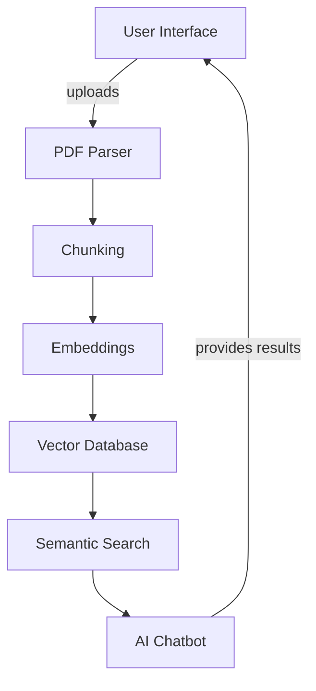

# PDF-CHAT

## 🎯 Project Overview

PDF-CHAT is a full-stack web application designed to revolutionize how users interact with PDF documents. Instead of manually reading through lengthy PDFs, users can now ask questions and receive instant, intelligent responses powered by advanced AI models. The application combines document processing, natural language understanding, and a modern web interface to provide a seamless user experience.
## Architecture

## AI Topics
### 1. Chunking
Chunking refers to the process of dividing the PDF document content into manageable pieces or chunks that can be processed and understood by the AI system effectively. This improves retrieval performance and allows for better context management during interactions.

### 2. Embeddings
Embeddings are numerical representations of text that allow algorithms to understand the semantics of words and phrases. They play a crucial role in enabling the system to compare the meaning of different chunks of text within the PDF and find relevant responses.

### 3. Vector Databases
Vector databases facilitate the storage and retrieval of high-dimensional vectors, which are essential for performing similarity searches. In the context of this project, they are used to store embeddings and enable quick access to relevant chunks during AI interactions.

### 4. Semantic Search
Semantic search goes beyond traditional keyword-based search by understanding the context and intent behind user queries. This feature enhances the user's ability to find accurate information in the PDF content, making the interaction more intuitive and efficient.

### 5. Contextual AI Chat
Contextual AI chat refers to the AI's ability to maintain context over a conversation. This means that the system can reference previous interactions and provide responses that are coherent and contextually relevant, improving the overall user experience.

# 📄 PDF-CHAT

## AI-Powered PDF Chat Application

**PDF-CHAT** is an intelligent document processing and chat application that allows users to upload PDF files and interact with their content through an AI-powered conversational interface. Built with cutting-edge technologies, this application seamlessly integrates PDF parsing, real-time chat capabilities, and AI-driven responses.

### Key Features
- 📤 **PDF Upload & Processing**: Upload and process PDF documents with intelligent text extraction
- 🤖 **AI-Powered Chat**: Interact with documents using advanced language models
- 💬 **Real-time Conversation**: Instant responses to user queries about document content
- 🔐 **Secure Authentication**: User authentication and session management with Clerk
- 💾 **Data Persistence**: Reliable document and chat history storage
- 🎨 **Modern UI/UX**: Responsive, intuitive interface with Tailwind CSS
- 🌐 **Serverless Architecture**: Scalable backend with edge-ready capabilities
- 📝 **Chat History**: Keep track of all conversations with documents

---

## 🛠 Tech Stack

### **Frontend**
| Technology | Version | Purpose |
|------------|---------|---------|
| **Next.js** | 14.0.3 | React-based framework for building full-stack web applications with server-side rendering and API routes |
| **React** | ^18 | UI library for building interactive user interfaces |
| **React DOM** | ^18 | DOM bindings for React |
| **TypeScript** | ^5 | Strongly-typed JavaScript for better code quality and developer experience |
| **Tailwind CSS** | ^3.3.0 | Utility-first CSS framework for rapid UI development |
| **Tailwind Merge** | ^2.0.0 | Utility to merge Tailwind CSS classes intelligently |
| **Tailwind CSS Animate** | ^1.0.7 | Animation plugin for Tailwind CSS |
| **PostCSS** | ^8 | CSS transformation tool for Tailwind CSS |
| **Autoprefixer** | ^10.0.1 | PostCSS plugin to automatically add vendor prefixes |

### **UI Components & Icons**
| Technology | Version | Purpose |
|------------|---------|---------|
| **Radix UI (React Slot)** | ^1.0.2 | Unstyled, accessible primitives for building design systems |
| **Lucide React** | ^0.292.0 | Beautiful, customizable icon library for React |
| **Class Variance Authority** | ^0.7.0 | TypeScript-first utility for creating component variants |
| **clsx** | ^2.0.0 | Utility for constructing className strings conditionally |

### **Backend & API**
| Technology | Version | Purpose |
|------------|---------|---------|
| **Next.js API Routes** | 14.0.3 | RESTful API endpoints for server-side functionality |
| **OpenAI Edge** | ^1.2.2 | Edge-compatible OpenAI API client for streaming AI responses |

### **Database & ORM**
| Technology | Version | Purpose |
|------------|---------|---------|
| **Drizzle ORM** | ^0.29.0 | Lightweight, type-safe SQL query builder for TypeScript |
| **Drizzle Kit** | ^0.20.4 | CLI tool for managing Drizzle schema and migrations |
| **PostgreSQL (pg)** | ^8.11.3 | Robust SQL database for storing documents and chat history |
| **Pinecone** | ^1.1.2 | Vector database for semantic search and embeddings |
| **Pinecone Doc Splitter** | ^0.0.1 | Utility for intelligent document chunking for embeddings |
| **NeonDatabase Serverless** | ^0.6.0 | Serverless Postgres solution for scalable database operations |

### **Authentication & User Management**
| Technology | Version | Purpose |
|------------|---------|---------|
| **Clerk** | ^4.27.1 | Complete authentication and user management solution with pre-built components |

### **AI & Machine Learning**
| Technology | Version | Purpose |
|------------|---------|---------|
| **AI** | ^2.2.24 | Unified library for working with various LLM providers |
| **LangChain** | ^0.0.192 | Framework for developing applications powered by large language models |

### **Document Processing**
| Technology | Version | Purpose |
|------------|---------|---------|
| **PDF-Parse** | ^1.1.1 | JavaScript PDF parser for extracting text and metadata from PDF files |
| **MD5** | ^2.3.0 | Cryptographic hash function for generating unique document identifiers |
| **@types/md5** | ^2.3.5 | TypeScript type definitions for MD5 |

### **HTTP Client & Data Fetching**
| Technology | Version | Purpose |
|------------|---------|---------|
| **Axios** | ^1.6.2 | Promise-based HTTP client for making API requests |
| **@tanstack/react-query** | ^5.8.4 | Powerful server state management library for managing, caching, and synchronizing remote data |

### **Cloud Services**
| Technology | Version | Purpose |
|------------|---------|---------|
| **AWS SDK** | ^2.1499.0 | Amazon Web Services SDK for cloud storage and services integration |

### **UI Notifications**
| Technology | Version | Purpose |
|------------|---------|---------|
| **React Hot Toast** | ^2.4.1 | Lightweight notification/toast library for React |
| **React Dropzone** | ^14.2.3 | React library for building drag-and-drop file upload zones |

### **Environment Management**
| Technology | Version | Purpose |
|------------|---------|---------|
| **dotenv** | ^16.3.1 | Load environment variables from .env files |

### **Development Tools**
| Technology | Version | Purpose |
|------------|---------|---------|
| **ESLint** | ^8 | JavaScript/TypeScript linter for code quality |
| **ESLint Config Next** | 14.0.3 | ESLint configuration optimized for Next.js projects |

---

## 📁 Project Structure

## Conclusion
This README serves as a guide to understanding the architecture and advanced AI topics relevant to the PDF-CHAT project. Further details and contributions are welcome as we continue to enhance this system.
