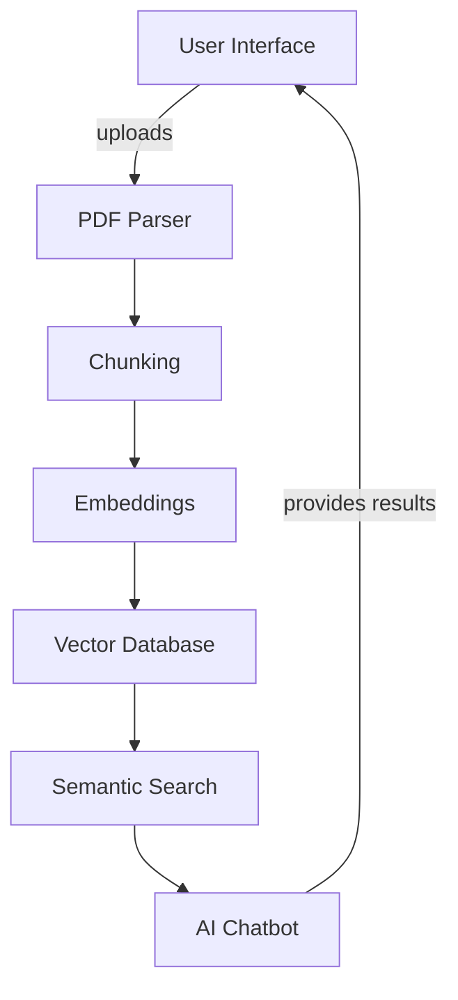

# PDF-CHAT

## Overview
This project aims to provide a system for interacting with PDF documents using AI-based chat functionalities.

## Architecture

## AI Topics
### 1. Chunking
Chunking refers to the process of dividing the PDF document content into manageable pieces or chunks that can be processed and understood by the AI system effectively. This improves retrieval performance and allows for better context management during interactions.

### 2. Embeddings
Embeddings are numerical representations of text that allow algorithms to understand the semantics of words and phrases. They play a crucial role in enabling the system to compare the meaning of different chunks of text within the PDF and find relevant responses.

### 3. Vector Databases
Vector databases facilitate the storage and retrieval of high-dimensional vectors, which are essential for performing similarity searches. In the context of this project, they are used to store embeddings and enable quick access to relevant chunks during AI interactions.

### 4. Semantic Search
Semantic search goes beyond traditional keyword-based search by understanding the context and intent behind user queries. This feature enhances the user's ability to find accurate information in the PDF content, making the interaction more intuitive and efficient.

### 5. Contextual AI Chat
Contextual AI chat refers to the AI's ability to maintain context over a conversation. This means that the system can reference previous interactions and provide responses that are coherent and contextually relevant, improving the overall user experience.

## Conclusion
This README serves as a guide to understanding the architecture and advanced AI topics relevant to the PDF-CHAT project. Further details and contributions are welcome as we continue to enhance this system.